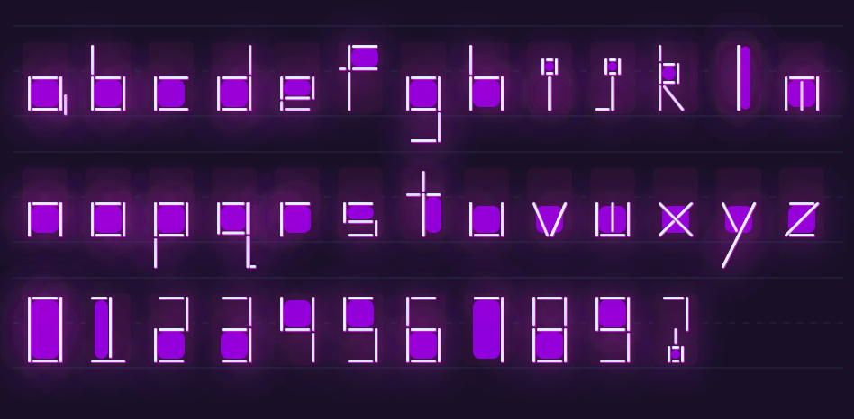
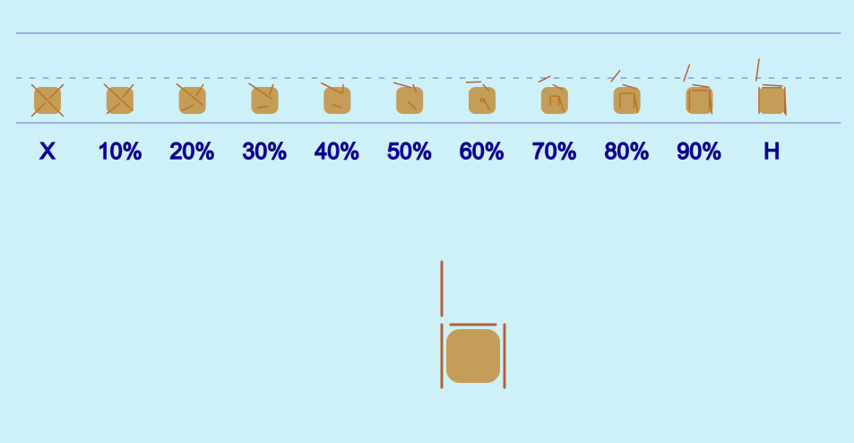
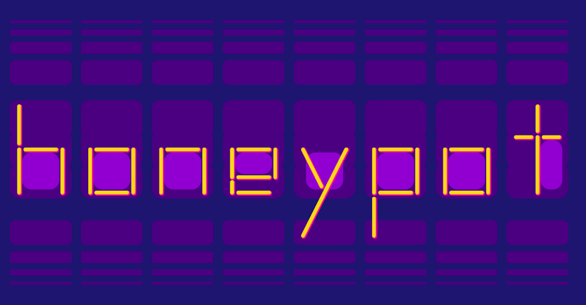
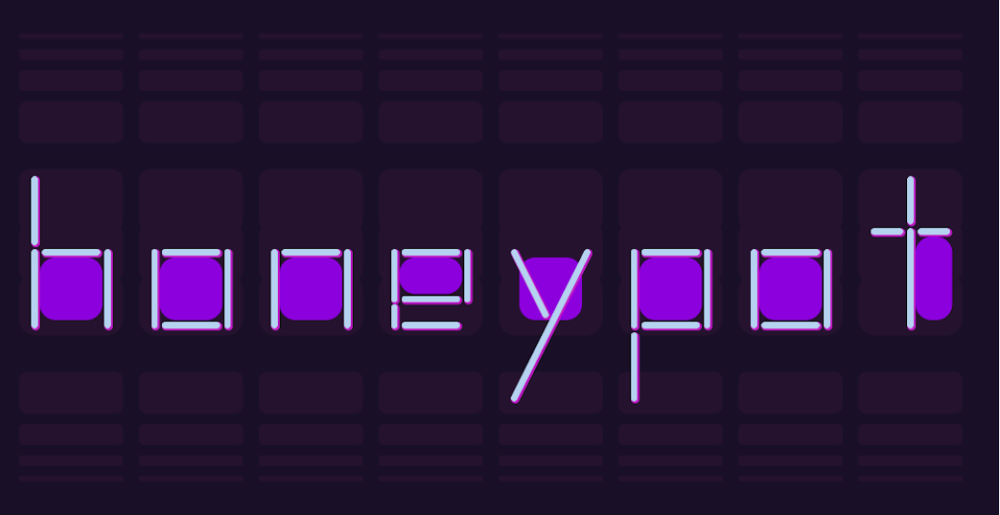

## MDDN 242 2023 Assignment 2

### Synthbox
**Daniel Gibbens**

For my alphabet design, each of my letters is created in lowercase using three lines and a custom rectangle function. The three lines are controlled by six x, y points using twelve parameters, while the rectangle function is controlled by six parameters. These parameters include the position (x, y), width, height, number of edges to draw, and the drawing order for those edges (either clockwise or counterclockwise). All of these lines and edges have a shadowBlur effect applied to make them look like neon lights. The rectangle function also draws a filled-in rectangle inside the edges. This rectangle is always drawn, but in most cases, it is used to fill an inner region of the letter, such as the inside of 'a' or 'p'. Additionally, each line/edge drawn features a shadow to the lower right. Finally, each letter is drawn over a fixed background of three rounded rectangles with an overlapping region. It should also be noted that in the exhibition there are additional rectangles that fade into the background as they get further from the glowing letters

By utilising a combination of edges on the rectangle and three lines, my design is capable of recreating all the required letters and numbers in multiple ways.

I decided on 'Synthbox' for the name of the font. The 'synth' derives from the colors used in the design, drawing inspiration from the synthwave style. The 'box' is inspired by the geometric design, with letters crafted in a box-like style, with rectangles being the most frequently used shape.

The nineteen parameters per letter:
  * `x1` : the x coordinate of the first point of the first line
  * `y1` : the y coordinate of the first point of the first line
  * `x2` : the x coordinate of the second point of the first line
  * `y2` : the y coordinate of the second point of the first line
  * `x3` : the x coordinate of the first point of the second line
  * `y3` : the y coordinate of the first point of the second line
  * `x4` : the x coordinate of the second point of the second line
  * `y4` : the y coordinate of the second point of the second line
  * `x5` : the x coordinate of the first point of the third line
  * `y5` : the y coordinate of the first point of the third line
  * `x6` : the x coordinate of the second point of the third line
  * `y6` : the y coordinate of the second point of the third line
  * `rectLines` : the number of edges to draw around the filled-in rectangle
  * `rectX` : the x coordinate of the rectangle
  * `rectY` : the y coordinate of the rectangle
  * `rectWidth` : the width of the rectangle
  * `rectHeight` : the height of the rectangle
  * `clockwiseLines` : either 0 to draw counterclockwise or 1 to draw clockwise
  * `interpolatePercent` : the percentage of interpolation

##### Preview:

### Part 1: Initial Ideas

For my sketch, I experimented with the idea of creating letters using only three primitive shapes, an ellipse, a rectangle, and a triangle. This concept drew inspiration from block letters and the building blocks that children play with. I imagined that each letter could be constructed by a child arranging these shapes in specific ways. For the colours, I opted for bright hues to align with the theme I aimed to convey.

##### Sketch:

The fifteen parameters used for each letter:
  * `ellipseSize` : the size of the ellipse
  * `rectWidth` : the width of the rectangle
  * `rectHeight` : the height of the rectangle
  * `rectXOffset` : the offset value on the X axis for the rectangle
  * `draw` : determines the order to draw the shapes
  * `posx` : the X position to draw all shapes relative to
  * `posy` : the Y position to draw all shapes relative to
  * `trianglePoint1X` : the X position of the first point of the triangle
  * `trianglePoint1Y` : the Y position of the first point of the triangle
  * `trianglePoint2X` : the X position of the second point of the triangle
  * `trianglePoint2Y` : the Y position of the second point of the triangle
  * `trianglePoint3X` : the X position of the third point of the triangle
  * `trianglePoint3Y` : the Y position of the third point of the triangle

The main issue with this design is I use custom draw functions to manipulate the order the shapes are drawn. A potential solution to this could be using three parameters to store the depth required for each shape determining the drawing order, eg for A in the sketch:
 * `ellipseDepth` : 3
 * `rectangleDepth` : 2
 * `triangleDepth` : 1
However, I do not believe that this design will interpolate smoothly, and I want to explore other ideas.

For my next design, I took inspiration from block letters and used trapezoids to shape each letter. However, when I sketched out a few concepts by hand, I didn't like how the converging points of three or more trapezoids looked. So, I decided to try using lines instead.

In this new approach, I chose to make my letters lowercase aiming for a more serene style. But I faced a problem of the maximum of twenty parameters. Even drawing just five lines required ten sets of x and y coordinates, using up most of these parameters. The issue escalated with letters like 'g' or numbers like '6' that needed six lines to be recognisable.

To solve this, I created a rectangle function that could be turned on or off with just one parameter. This change meant that letters like 'g' could be made with only the rectangle and two lines. With this modification, I only needed twelve parameters to control three lines, and five more for the rectangle's position (x, y), width, height, and the toggle.

##### Initial Design:

### Part 2: Design the Alphabet
I wanted to have an incredible amount of flexibility to create all kinds of symbols while still ensuring they remained very legible. Therefore, I decided to continue developing my block lines design. Initially, I felt that the lines alone were too plain, so I introduced a splash of colour by incorporating a filled-in rectangle for the inner regions of the letters. My intention was to create visible spacing between the lines, accentuating the edges of each line. Given the curved nature of the lines, I maintained consistency with the design's mood by curving the inner rectangle as well.

This design was effective until I reached the letter 'f'. Here, I needed five lines without a full rectangle. To accommodate this, I adjusted the rectangle toggle to correlate with the edge count. This approach served well until I encountered the number '3'. This character required drawing the edges of the rectangle in a specific order, as the initial line drawn was on the left, needing to remain empty for the '3' shape. To address this, I introduced a parameter to control the sequence of line drawing.

I had decided that letters with parts that hang over the "baseline" should extend outside the bounding box. I made this decision because my text is in lowercase, and it would appear incorrect for letters like 'b' and 'p' to start at the same height.

Throughout this phase, I also dealt with minor issues. These included determining the ideal shapes, heights, and positions for filled-in rectangles in specific letter cases such as 'f', 'l', 'm', 's', 't', and '?'.

Finally, since I knew these letters would be interpolated, I tried to ensure that even if two letters had a similar shape, they would be drawn slightly differently. For example, while both 'b' and 'd' have stems, I used distinct lines for each stem. This approach creates a more unique and intriguing interpolation animation, rather than just having the stem move to the right.

The nineteen parameters at this point are:
  * `x1` : the x coordinate of the first point of the first line
  * `y1` : the y coordinate of the first point of the first line
  * `x2` : the x coordinate of the second point of the first line
  * `y2` : the y coordinate of the second point of the first line
  * `x3` : the x coordinate of the first point of the second line
  * `y3` : the y coordinate of the first point of the second line
  * `x4` : the x coordinate of the second point of the second line
  * `y4` : the y coordinate of the second point of the second line
  * `x5` : the x coordinate of the first point of the third line
  * `y5` : the y coordinate of the first point of the third line
  * `x6` : the x coordinate of the second point of the third line
  * `y6` : the y coordinate of the second point of the third line
  * `rectLines` : the number of edges to draw around the filled-in rectangle
  * `rectX` : the x coordinate of the rectangle
  * `rectY` : the y coordinate of the rectangle
  * `rectWidth` : the width of the rectangle
  * `rectHeight` : the height of the rectangle
  * `rectOffset` : the gap between the edges and the filled-in rectangle
  * `rectOrder` : determines order lines are drawn in

##### Alphabet when complete:

##### Alphabet with final design:

### Part 3: Interpolation

While working on interpolation development, handling the interpolation of the three lines was straightforward. I used the map function with percentage and coordinate values to smoothly transition between old and new objects.

However, I encountered challenges with the rectangle drawing function. The problem was the rectangle's edges were drawn in relation to a single x, y coordinate. This made it difficult to interpolate individual points along the edges, only allowing for the entire rectangle to be smoothly transitioned. Additionally, changing the number of edges led to abrupt animations, where edges suddenly appeared or disappeared, unlike the smooth transitions of the individual lines.

To solve this, I first tried using lambdas to override the draw function during interpolation. But this approach clashed with the project's guidelines. So, I took an alternate approach. I stored the percentage value and used an if condition while drawing the rectangle. If the percent value was not zero, I then used a separate function to smoothly move the edges toward the center of the filled-in rectangle as the percentage reached 50. At 50%, the edges converged and disappeared, coinciding with a change in the number of edges. Then, as the percent value increased from 50 to 100, the new number of edges smoothly moved to their respective positions. This results in the rectangle helping to maintain a consistent letter shape during transitions, while the lines can then build on this, creating interesting variations of the same overall movement.

##### Interpolation when function complete:

##### Interpolation with final design:

### Part 4: Exhibition
Throughout this phase, I implemented several enhancements to my overall design.

Initially, I experimented with colour palettes, keeping to a softer tone but improving upon the colours I had already been using.

##### Honeypot Design:

Upon receiving feedback, I began experimenting with different colour palettes, drawing inspiration from "synthwave" and "space groove." This led me to create three more designs. All of these designs use vibrant colours on a darker background to enhance the visual impact of each letter.

Note:
At the time of creating these colour palettes, the font name I was using was "honeypot." This was because the main colours of the previous design consisted of oranges and yellows, as well as the word "honeypot" was able to effectively showcase various letter forms.

##### Colour Moodboard:

##### New Designs:

Other improvements include background rectangles to enhance visual hierarchy between letters as well as shadows for each line/edge to create a sense of depth

I also realised that I had not changed the offset parameter because it would not fit well with the design. So, I decided to turn it into a constant instead of a changeable parameter. This decision was based on keeping the design balanced and consistent. By having a consistent offset, I ensured that the design remained visually harmonious. If I allowed varying gaps between the edges and the rectangle using the offset parameter, it could disrupt the overall balance.

Another experiment I conducted involved attempting to create contrast by drawing the three lines using a different stroke color than the edges of the rectangle. However, I ultimately decided against it as it made the piece too overwhelming.

I then wanted to showcase multiple colour palettes, as I found myself liking more than one. The idea was to change the colours as words were interpolated, effectively enhancing visual variety. However, upon reviewing the template provided, it became clear that this approach was not feasible since this would cause the background to change colour when a single letter changed. So, instead, I enabled manual changes using HTML as well as created a new text colour palette to showcase my font in a normal text environment.

##### Text Design:

My final addition was a neon glow and a thin white line in the very center of each line. This addition provided the final level of detail I was aiming for. The neon effect serves to illuminate each letter in contrast to the background, while the inner line helps create depth for each line, enhancing the 3D effect.

I experimented with different levels of this neon effect. However, due to how I implemented my interpolation method (with unused lines being drawn on top of other lines) and how the neon effect works (multiple lines drawn on top of one another increase the intensity of the effect), it resulted in some lines having a much more pronounced effect than others. This is particularly noticeable with the letter 'l'.

This dilemma led me to decide whether to keep my current design with interesting and distinct interpolations or to avoid drawing all unused lines, ensuring that all lines on a letter have the same level of neon effect. I chose to retain the current interpolations as they are a significant part of my design, and altering them would make the piece appear rather dull. This choice adds a touch of realism, as in the real world, not all lights shine equally, with some lights having a brighter glow than others.

While this addition may not complement the honeypot theme, I chose to retain it in the HTML as it represents the first colour palette iteration. To accommodate this addition, I made adjustments to the current colour theme configurations. This allows me to adjust or remove these elements for both the text and honeypot themes. These configurations are solely intended for showcasing the design in different settings and should not be considered parameters for the design, as they are not included in letter.js.

##### Neon Designs:

